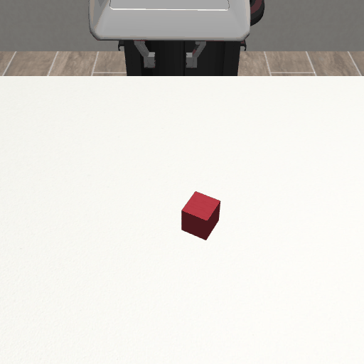
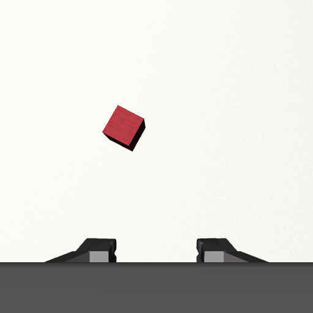
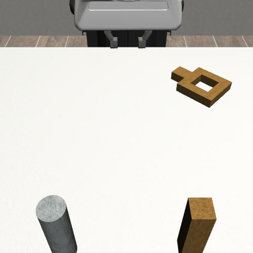

# Data Collection

## Dependency Setup

### `robomimic`
Installing from source as recommended [here](https://robomimic.github.io/docs/introduction/installation.html#install-robomimic).  

For example:
1. mkdir libs/robomimic
2. git clone --depth=1 https://github.com/ARISE-Initiative/robomimic libs/robomimic
3. pip install -e libs/robomimic/

### `robosuite`
Installing from source as recommended [here](https://robosuite.ai/docs/installation.html#install-from-source).  

For example:
1. mkdir libs/robosuite
2. git clone --depth=1 https://github.com/ARISE-Initiative/robosuite libs/robosuite
3. pip install -e libs/robosuite/
4. pip install -r libs/robosuite/requirements-extra.txt

## Dataset Download
Downloading the `proficient human` demonstrations for the `lift` task, using the robomimic dataset download script as recommended [here](https://robomimic.github.io/docs/datasets/robomimic_v0.1.html#method-1-using-download-datasets-py-recommended).  

For example:
1. mkdir data
2. python ./libs/robomimic/robomimic/scripts/download_datasets.py \  
 --tasks lift --dataset_types ph --hdf5_types raw --download_dir ./data
3. mv ./data/lift/ph/demo_v15.hdf5 ./data/lift/ph/raw.hdf5

## Observations and Rewards Extraction
The documentation recommends using the `extract_obs_from_raw_datasets.sh` script ([here](https://robomimic.github.io/docs/datasets/robomimic_v0.1.html#postprocessing)), however we will stick with `dataset_states_to_obs.py` as it allows for more fine-grained control over the output.  

We want to extract:
1. Robot joints and gripper states
2. Images from available cameras

The dataset contains demonstrations of the task performed with the Panda arm, as we can see with the `get_dataset_info.py` script from robomimic (suggested [here](https://robomimic.github.io/docs/tutorials/dataset_contents.html#viewing-hdf5-dataset-structure)). This means that we have two available cameras: `robotview` and `eye_in_hand`. The cameras' definitions can be found in the Panda arm MuJoCo model [here (in lines 135, 224)](https://github.com/ARISE-Initiative/robosuite/blob/master/robosuite/models/assets/robots/panda/robot.xml).

Example for the `get_dataset_info.py`:  
1. python ./libs/robomimic/robomimic/scripts/get_dataset_info.py --dataset ./data/lift/ph/raw.hdf5

Example for the `dataset_states_to_obs.py`:
1. python ./libs/robomimic/robomimic/scripts/dataset_states_to_obs.py \  
--dataset /content/data/lift/ph/raw.hdf5 --output_name full.hdf5 \  
--shaped --camera_names robot0_robotview robot0_eye_in_hand \  
--camera_height 512 --camera_width 512 --done_mode 0 \
--compress --exclude-next-obs

*Note:*  
*For available flags and their semantics see `dataset_states_to_obs.py` source code [here](https://github.com/ARISE-Initiative/robomimic/blob/master/robomimic/scripts/dataset_states_to_obs.py).*

## Sample Trajectory

### Block Lifting

#### `robotview`

#### `eye_in_hand`

### Nut Assembly (Square)

#### `robotview`

#### `eye_in_hand`

## Additional Info
- Running the "Observation and Rewards Extraction" step took <10min on a laptop GPU (NVIDIA GeForce RTX 3050 Laptop) and utilized <<1GB of VRAM (~500MB) for the "block-lifting" dataset and <15min, and around the same VRAM for "nut assembly".
- The datasets with images are heavy - 3GB and 10GB each. The embedding ones are lighter (<200MB).
- I didn't manage to perform the "Observation and Rewards Extraction" step on Google Colab. Neither the CPU nor GPU environments seemed to work. When trying to use the `egl` engine the program segfaulted (failed to set `mujoco_ctx`) - `egl_probe` revealed that there was no device available for rendering. I tried to set a different MuJoCo rendering engine (osmesa) that supposedly uses only the CPU, but this approach failed as well.